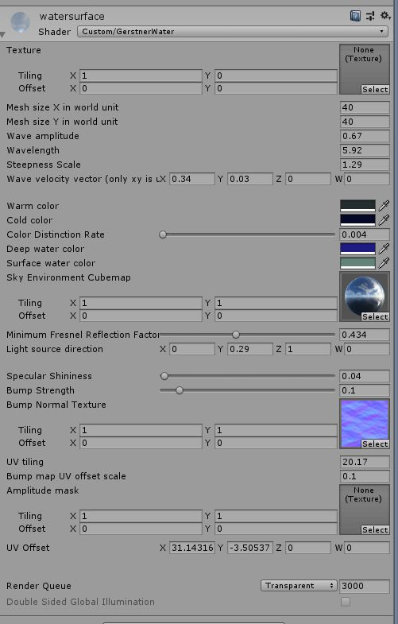

# Gerstner-Water
A Unity shader for simulating water surfaces with Gerstner waves. Some shading effects such as Fresnel and bump mapping are also included to make the water more realistic.

## Usage

- Install Unity (tested on version 2019.2.3f1).
- Open Assets/Scenes/Scene.unity.
- Play with various parameters and try out the effect!

Note: Terrain assets are from [Free Island Collection](https://assetstore.unity.com/packages/3d/environments/landscapes/free-island-collection-104753) on Unity Asset Store. Some textures are downloaded from the Internet.

## Reference

Effective Water Simulation from Physical Models: https://developer.nvidia.com/gpugems/GPUGems/gpugems_ch01.html